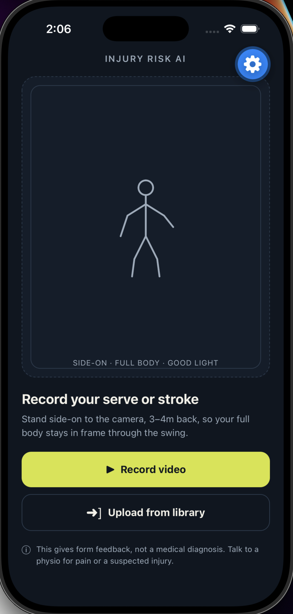
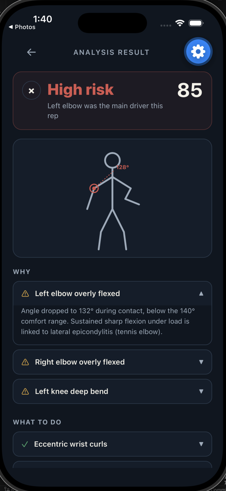
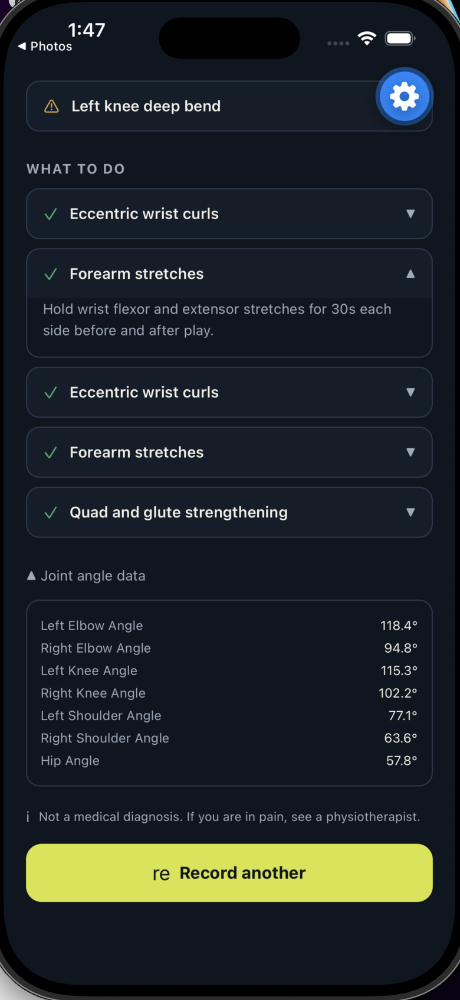
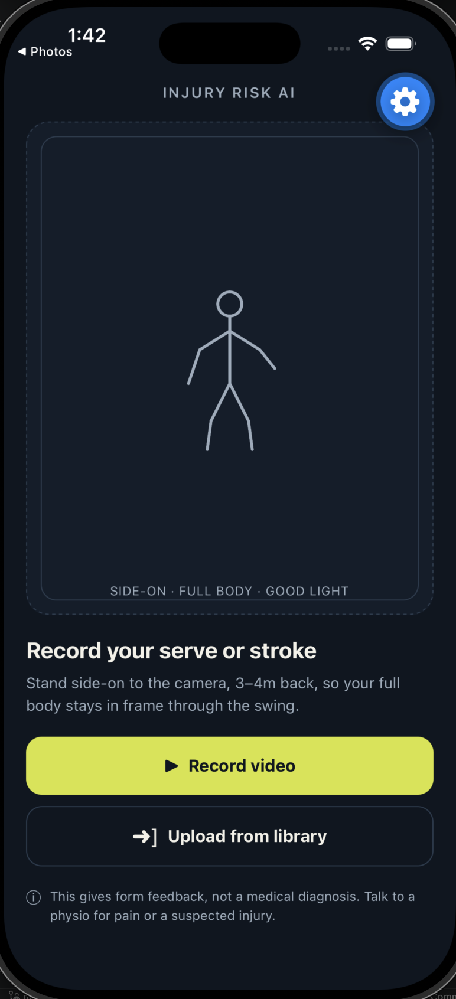

# Injury Risk AI

AI‑powered tennis injury prevention with a FastAPI backend, a React Native mobile app, and an **asynchronous Celery + Redis task pipeline** for real‑time video processing.

## Overview

Injury Risk AI records or uploads a short tennis stroke video, extracts pose landmarks, computes joint angles, and returns a risk level with corrective guidance. The app supports both a trained ML model and a rule‑based fallback engine.

Processing is fully asynchronous: the frontend submits a job and polls for results – no timeouts, no stuck progress bars.

## Screenshots

<p align="center">
  
  
</p>

<p align="center">
  
  
</p>

<p align="center">
  
</p>

## Key Features

- Video capture and upload from the mobile app
- MediaPipe‑based pose estimation and joint‑angle extraction
- ML risk prediction (RandomForest) with rule‑based fallback
- **Asynchronous background processing** with Celery + Redis – no timeouts
- Risk score, flagged joint, risk factors, and recommendations
- Temporary processing – uploaded videos are deleted after analysis

## Tech Stack

| Layer | Technology |
| :--- | :--- |
| Frontend | React Native + Expo |
| Backend API | FastAPI (Python) |
| Task Queue | Celery + Redis |
| Pose Estimation | MediaPipe |
| ML Model | scikit‑learn RandomForest |
| Deployment | (local / cloud ready) |

## Project Structure

```
injury-risk-ai/
├── backend/
│   ├── app/                # FastAPI app
│   ├── celery_app.py       # Celery configuration
│   ├── tasks.py            # Celery tasks (video processing)
│   ├── risk_model.pkl      # Trained ML model
│   └── requirements.txt
├── frontend/
│   ├── src/
│   ├── .env
│   └── package.json
├── Dataset/                # Local training assets (ignored by Git)
└── assets/                 # Screenshots for README
```

## Backend Setup

```bash
cd backend
python3 -m venv venv
source ./venv/bin/activate
pip install -r requirements.txt
```

Make sure **Redis** is installed (macOS):

```bash
brew install redis
brew services start redis
```

## Frontend Setup

```bash
cd frontend
npm install
```

Create `frontend/.env` with your Mac LAN IP (the one that stays the same on Wi‑Fi):

```env
EXPO_PUBLIC_API_URL=http://192.168.100.225:8000
```

If your Wi‑Fi changes, update the IP before starting Expo again.

## Run The Async Version (Four Services)

You need **four separate terminal windows** – keep all running.

### 1. Redis (message broker)

```bash
brew services start redis
```

### 2. Celery Worker (processes videos)

```bash
cd backend
source ./venv/bin/activate
MEDIAPIPE_DISABLE_GPU=1 PYTHONPATH=. celery -A celery_app worker --loglevel=info --concurrency=1 --pool=solo
```

> The `--pool=solo` and `MEDIAPIPE_DISABLE_GPU=1` avoid MediaPipe fork‑related crashes on macOS.

### 3. FastAPI Backend

```bash
cd backend
source ./venv/bin/activate
uvicorn app.main:app --host 0.0.0.0 --port 8000 --reload
```

### 4. Expo Frontend

```bash
cd frontend
npx expo start --lan -c
```

Scan the QR code with Expo Go (phone) or press `i`/`a` for simulators.

## API Endpoints

| Method | Endpoint | Description |
| :--- | :--- | :--- |
| `POST` | `/analyze` | Multipart video upload (sync, fallback) |
| `POST` | `/analyze-json` | Base64 video upload (sync) |
| `POST` | `/analyze-async` | **Submit a video for async processing** – returns `job_id` |
| `GET` | `/job-status/{job_id}` | Poll for job status and result |
| `POST` | `/analyze/compare` | Compare ML vs rule‑based outputs (debug) |
| `GET` | `/health` | Health check and ML availability |

## How It Works (Async Flow)

1. **Mobile app** records or picks a video → encodes as Base64.
2. **`POST /analyze-async`** → FastAPI creates a Celery task and returns a `job_id` **instantly**.
3. **Celery worker** processes the video (pose estimation → angles → risk prediction).
4. **App polls** `GET /job-status/{job_id}` every 2 seconds until the result is ready.
5. **Result appears** – no timeouts, no “stuck at 98%”.

## Model Notes

- The backend loads `backend/risk_model.pkl` if available.
- If the model is missing or incompatible, it **falls back** to the rule‑based engine – no crashes.
- To regenerate the model with your current dependencies:

```bash
cd backend
source ./venv/bin/activate
python train_model.py
```

## Troubleshooting

| Problem | Solution |
| :--- | :--- |
| `fetch failed: Could not connect` | Backend running? Check IP in `.env`. Phone and Mac on same Wi‑Fi. |
| Celery worker crashes with `SIGABRT` | Use `--pool=solo` and `MEDIAPIPE_DISABLE_GPU=1` (as shown above). |
| Model load error on startup | Rebuild model with `python train_model.py`. |
| Expo starts from wrong folder | Use the absolute path: `npm --prefix ~/Desktop/injury-risk-ai/frontend run start -- --lan -c`. |
| All results are “High” | That’s expected for extreme form. Tune thresholds in `risk_engine.py` if needed. |