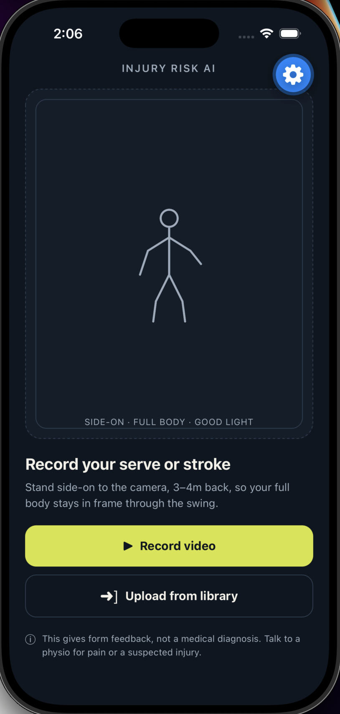
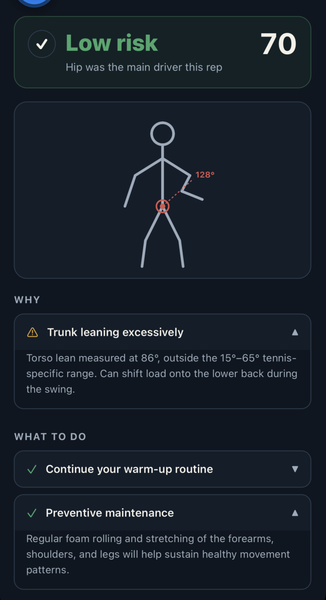
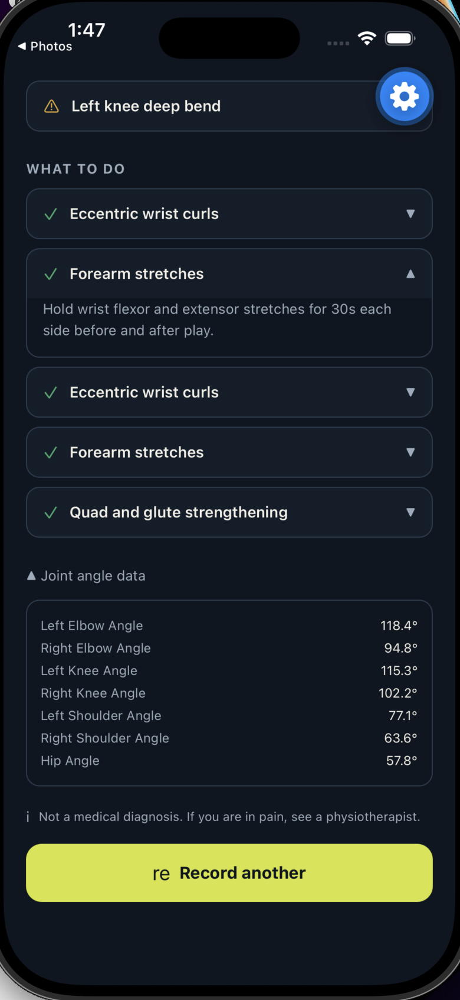
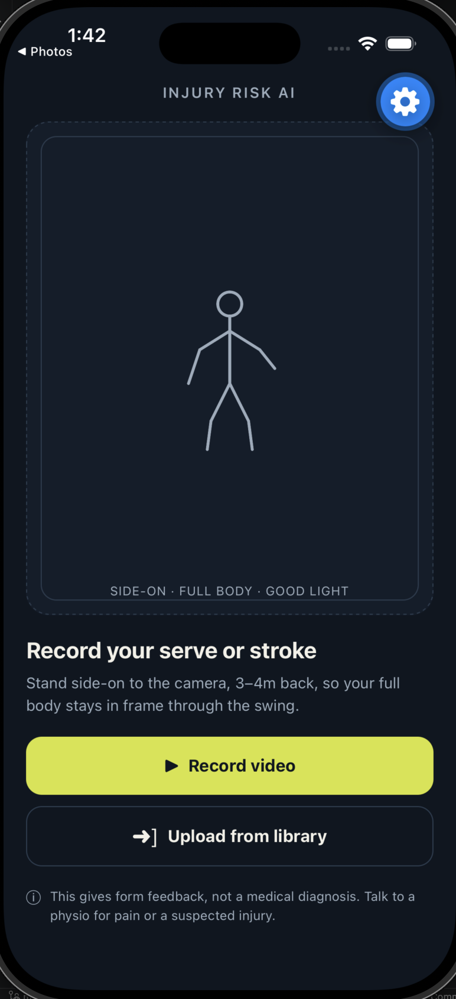

# Injury Risk AI

AI-powered tennis injury prevention with a FastAPI backend and an Expo mobile app.

## Overview

Injury Risk AI records or uploads a short tennis stroke video, extracts pose landmarks, computes joint angles, and returns a risk level with suggested corrective guidance. The app supports both a trained ML model and a rule-based fallback engine.

## Screenshots










## Key Features

- Video capture and upload from the mobile app
- MediaPipe-based pose estimation and joint-angle extraction
- ML risk prediction with rule-based fallback
- Risk score, flagged joint, risk factors, and recommendations
- Temporary processing flow without storing uploaded videos

## Tech Stack

- Frontend: React Native with Expo
- Backend: FastAPI
- Pose estimation: MediaPipe
- ML model: scikit-learn RandomForest

## Project Structure

- `backend/` FastAPI API, pose analysis, rule-based and ML risk engines
- `frontend/` Expo/React Native mobile app
- `Dataset/` local training dataset assets

## Backend Setup

Use Node.js 22 for the Expo frontend (Expo warns on Node 20.17.0). Prepare the Python environment once from the project root:

```bash
python3 -m venv .venv
source .venv/bin/activate
pip install -r backend/requirements.txt
```

Install the frontend packages once:

```bash
cd frontend
npm install
```

## Run The App

Each time you run the app, open two terminals from the project root.

In terminal 1, start the API:

```bash
source .venv/bin/activate
cd backend
uvicorn app.main:app --host 0.0.0.0 --port 8000 --reload
```

Wait for the API to start, then check `http://127.0.0.1:8000/health`. The API must be running before using video analysis.

In terminal 2, start Expo using Node.js 22:

```bash
cd frontend
nvm use 22
EXPO_PUBLIC_API_URL="http://$(ipconfig getifaddr en0):8000" npm run start -- --lan --clear
```

Open `http://localhost:8081/` on the Mac. If Expo reports that port 8081 is occupied and offers another port, use the URL it prints instead.

For a physical phone on the same Wi-Fi, scan the QR code shown by Expo. The API URL above uses the Mac's current Wi-Fi address; if your active network interface is not `en0`, replace the value with the Mac's LAN IP. Keep both terminals running while using the app.

To stop the app, press `Ctrl+C` in each terminal. Run the same two startup commands next time.

The current API health response reports `ml_engine_available: false`; analysis still works through the rule-based fallback, but ML predictions are unavailable until a compatible trained model is present.

## API Endpoints

- `POST /analyze-json` base64 video upload via JSON
- `POST /analyze` multipart video upload
- `POST /analyze/compare` compare ML vs rule-based output
- `GET /health` health check and ML availability

## Model Notes

- The backend loads `backend/risk_model.pkl` when available.
- If the model artifact is incompatible with installed packages, the API falls back to the rule-based engine instead of crashing.
- To regenerate the model with current dependencies:

```bash
cd backend
source ../.venv/bin/activate
python train_model.py
```

## Enhanced Model And Active Learning

From the project root, activate the environment and run the enhanced training and sample selection scripts:

```bash
source .venv/bin/activate
cd backend
python training/train_enhanced_model.py
python training/active_learning_selector.py
```

The selector writes 50 uncertain samples to `backend/data_processing/for_expert_labeling.csv`. The file omits the existing heuristic risk labels and includes a blank `expert_risk_level` column for independent review. Review and merge expert labels into the training data before retraining.

The current 92.3% holdout accuracy is measured against risk categories generated by this project's rule engine. It is not measured against observed injuries or independent clinical labels, so it should not be presented as injury-prediction accuracy.

## Troubleshooting

- `fetch failed: Could not connect to the server`
  - Make sure the backend is running with `--host 0.0.0.0`
  - Make sure the phone and Mac are on the same Wi-Fi
  - Restart Expo with `EXPO_PUBLIC_API_URL` set to the Mac's current LAN IP as shown above
- Expo warns about the Node version
  - Run `nvm use 22` in the frontend terminal before starting Expo
- Port 8081 is already in use
  - Stop the other Expo process or use the alternate port Expo offers and open its printed URL
- Model load error on backend startup
  - Rebuild the model with `python train_model.py`
